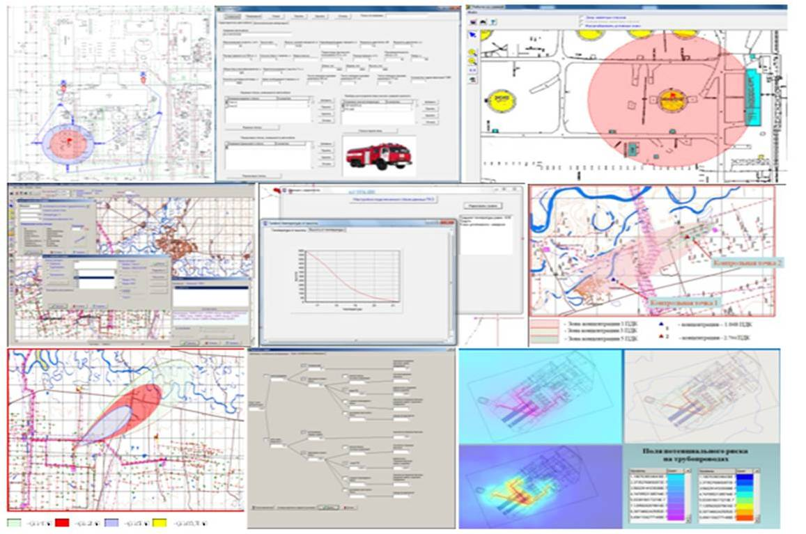
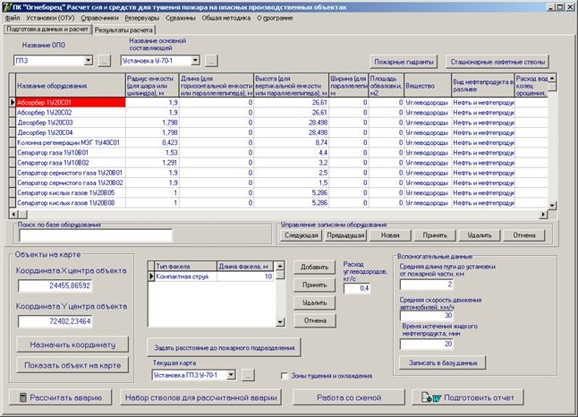
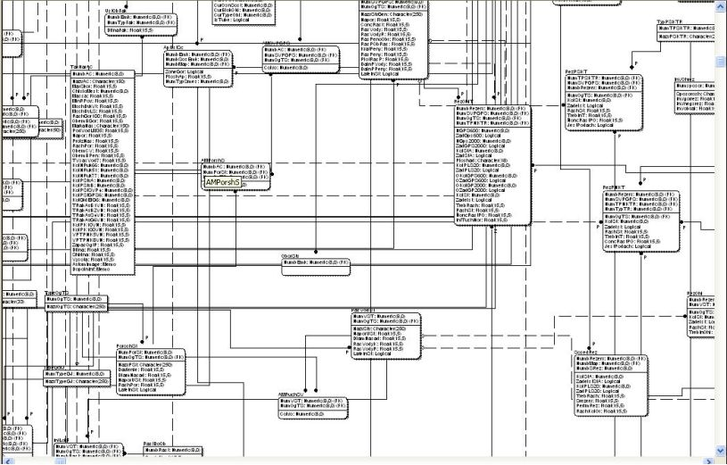
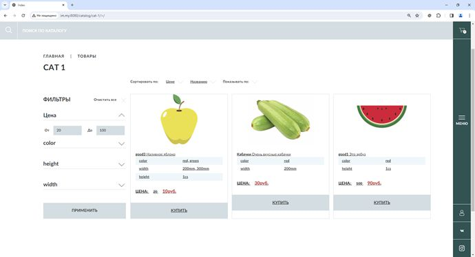
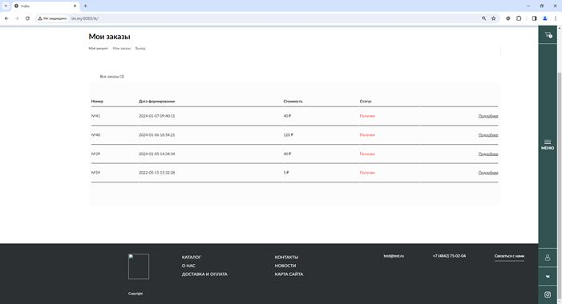
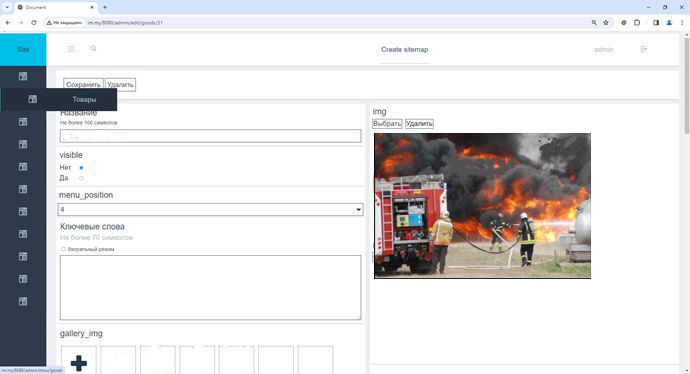

# Привет, меня зовут Сергей!
- :mailbox: Как связаться со мной: 
---

### :man_technologist: Обо мне:

  
<b>Опыт работы:</b>
Главный специалист сектора программного обеспечения (ПО). Разрабатывал ПО для нефтегазовой отрасли в области промышленной, пожарной и экологической безопасности, а также занимался созданием компьютерных программ систем оповещения на месторождениях (срабатывание датчиков, активация оповещателей, отображение спасательных бригад и автомобилей по GPS и т.д.). Разработал программу построения полей рисков и составления деклараций промышленной безопасности. Запрограммировал методики токсического воздействия, струевого горения, пожара пролива, расчета времени прихода фронта опасных загрязняющих веществ к населенным пунктам и т.д. Создал программу расчета сил и средств для тушения пожаров. Запрограммировал собственный векторизатор. Мои разработки внедрены и используются в 6 предприятиях РФ и Казахстана. Проектировал и реализовывал базы данных в СУБД MS SQL Server, MySQL, SQLLite, Access, DBase IV для нефтегазовой отрасли. 
Имею опыт проектирования Web-приложений (интернет-магазин).

<b>Языки программирования, серверы, СУБД:</b> C++11,14,17, библиотека STL, C#, Embarcadero Rad studio 10.2-11.1 (C++Builder, Delphi), VCL, Indy, Delphi 7, Visual Studio C++ 2022, INI-файлы, XML, JSON, DBase4, MS Access, VBA, MS SQL Server 2005-2019, PostGreSQL, ErWin, Interbase, SQLite, ADO, FireDAC, DataSnap, FireMonkey, Visual Studio Code, PhpStorm (WebStorm), Apache, Open Server, Matlab, Assembler (базовый, Masm), программирование серверов и клиентов TCP/IP, DCOM, HTTP (С++Builder);
COM-порты – RS-232, RS-485, программировал работу с COM-портами в C++Builder, Delphi; программирование получения и отправки почты (POP, SMPT) на C++Builder; 
опыт программной обработки таблиц Excel на С#; опыт создания приложений Windows Forms на C# в Visual Studio;
Git, GitHub.

<b>Владение Web-средствами проектирования и технологиями:</b> HTML5, CSS3, JS, jQuery, JSON, XML, AJAX, PHP 7.3, MySQL 5.7, BrainyCP (Проекты - «Разработка интернет-магазина» (админ-панель, пользовательская часть, личный кабинет, каталог заказов, фильтрация, поиск, высылка сформированных заказов на email - автоматически на PHP 7.3, JS, jQuery, MySQL 5.7, HTML5, CSS3, в модели MVC был разработан собственный Framework).
### 💻 Технологии:

  
 &nbsp 
  &nbsp 
  &nbsp
  &nbsp
  &nbsp
  &nbsp
 &nbsp
&nbsp 
 &nbsp
 &nbsp
 &nbsp
 &nbsp
 &nbsp
 &nbsp
&nbsp  
&nbsp
 
  <!-- &nbsp; -->

---

<b>Основные навыки программирования:</b>
Разработка Desktop и Web приложений. Клиент-серверные и многозвенные приложения. Работа с сетью (Wireshark, InSSiDer, WinSCP, PuTTY), сокеты на C++Builder, Delphi (участие в проекте рассылки обновлений программ через сокеты – пересылка файлов и сообщений). 
Работа с реестром (выполнял проекты регистрации программ через реестр (написал программу) – генерировал ключ запроса и ключ ответа на основе характеристик оборудования через реестр. 
Работа с ролями пользователей, параллельными вычислениями - потоками, задачами (TThread, PPL, WINAPI) программировал параллельные вычисления по реализованным мною методикам, создание служб и библиотек, программирование методов серверов (DataSnap), шифрование данных – программировал шифрование критических данных в БД (AES 128, MD5, BASE64), программировал ключ USB Guardant API для защиты программ со встраиванием кода сетевого вызова в защищаемую программу.
Опыт работы в Linux, в том числе в отечественных операционных системах, проектирование приложений для отечественных операционных систем (на базе Linux) – Delphi Rad Studio, C++Builder (программировал Desktop-прижения под Linux с работающими в них базами данных). 
Программирование COM-приложений – (автоматизация отчетов Word с таблицами сложной структуры при составлении деклараций промышленной безопасности). 
Знаком с протоколами RS-232, RS-485 (программировал взаимодействие с COM-портами в C++Builder, Delphi). 
Программировал серверы и клиенты DCOM, TCP/IP, HTTP.
Разрабатывал и программировал методики и базы данных (3НФ ErWin) (более 100 связанных таблиц), MS SQL Server – таблицы, запросы, хранимые процедуры, клиент - получение данных с постов контроля загрязнений и аэропоста, программирование методик, отчетов, клиентов для б.д. MS SQL Server, б.д. DBase 4, SQLite.

Имею опыт программной обработки таблиц Excel на С#. Имею опыт создания приложений Windows Forms на C# в Visual Studio.

<b>Пользовательские навыки:</b> Easy Trace, ArcGis, MapInfo, AutoCad, Excel, Word, Oracle VM VirtualBox, Windows, Linux

---

Ниже представлены скрины разработанных мною программ.

    
 <b>Мои разработки</b>

 

  
 <b>Технологические установки</b>
 

   
 <b>База данных</b>

   
 <b>Каталог заказов Интернет-магазина</b>
 

    
 <b>Заказы в личном кабинете</b>
 

 
    
 <b>Админ-панель</b>

---
### 💻 Образование:

1.	Инженер по специальности: «Разработка и эксплуатация нефтяных и газовых месторождений» (диплом с отличием), РГУ нефти и газа имени И.М. Губкина.  
2.	«Информационные системы в экономике» (диплом с отличием), ОГУ.  
3.	Кандидат экономических наук, специальность 08.00.13 «Математические и инструментальные методы экономики». Диссертация по промышленной безопасности и управлению рисками в нефтегазовой отрасли (ПГУ, Пермь). 

---
### 🤝 Награды и достижения:

  

Автор 50 научных работ. 3 премии губернаторов и правительства Оренбургской области в сфере науки и техники. Диплом «За лучшую научную разработку» научно-технической конференции молодых работников дочерних обществ ОАО «Газпром».  Автор 5 свидетельств о государственной регистрации программ для ЭВМ (Роспатент). Золотая и серебряные медали на Международном салоне инноваций и инвестиций за разработанные мною программы. Проводил обучение по работе с моими программами и по промышленной безопасности для англоязычного персонала на английском языке без помощи переводчика.
  

---
<!--  
-->

